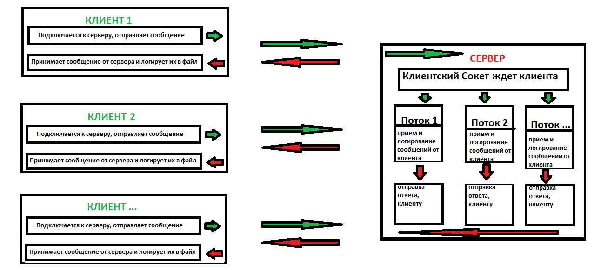

# Курсовой проект "Сетевой чат"
## Описание проекта
Вам нужно разработать два приложения для обмена текстовыми сообщениями по сети с помощью консоли (терминала) между двумя и более пользователями.

`Первое приложение - сервер чата`, должно ожидать подключения пользователей.

`Второе приложение - клиент чата`, подключается к серверу чата и осуществляет доставку и получение новых сообщений.

Все сообщения должны записываться в `file.log` как на сервере, так и на клиентах. `File.log` должен дополняться при каждом запуске, а также при отправленном или полученном сообщении. Выход из чата должен быть осуществлен по команде `exit`.

## Требования к серверу
- Установка порта для подключения клиентов через файл настроек `(например, settings.txt)`;
- Возможность подключиться к серверу в любой момент и присоединиться к чату;
- Отправка новых сообщений клиентам;
- Запись всех отправленных через сервер сообщений с указанием имени пользователя и времени отправки.
## Требования к клиенту
- Выбор имени для участия в чате;
- Прочитать настройки приложения из файла настроек - например, номер порта сервера;
- Подключение к указанному в настройках серверу;
- Для выхода из чата нужно набрать команду выхода - `“/exit”`;
- Каждое сообщение участников должно записываться в текстовый файл - файл логирования. При каждом запуске приложения файл должен дополняться.
## Требования в реализации
- Сервер должен уметь одновременно ожидать новых пользователей и обрабатывать поступающие сообщения от пользователей;
- Использован сборщик пакетов gradle/maven;
- Код размещен на github;
- Код покрыт unit-тестами.
## Шаги реализации:
- Нарисовать схему приложений;
- Описать архитектуру приложений (сколько потоков за что отвечают, придумать протокол обмена сообщениями между приложениями);
- Создать репозиторий проекта на github;
- Написать сервер;
- Провести интеграционный тест сервера, например с помощью telnet;
- Написать клиент;
- Провести интеграционный тест сервера и клиента;
- Протестировать сервер при подключении нескольких клиентов;
- Написать README.md к проекту;
- Отправить на проверку.

# Реализация
## Схема приложений

## Архитектура приложений
### Клиент
- При подключении нового пользователя запрашивается его имя;
- Из файла настроек `settings.txt` получаем номер порта для подключения к серверу;
- Начинается чат;
- Сообщение пользователя оправляются на сервер, с указанием времени и данных пользователя;
- От сервера получаем сообщения пользователей и записывает их в файл `file.log` с временем сообщения и данными пользователя, файл общий для всех пользователей;
- Когда пользователь хочет завершить переписку, он вводит команду `exit` и выходит из переписки. При этом логируется сообщение "Пользователь покинул чат" с временем и именем пользователя.

### Cервер
- Из файла настроек `settings.txt` получаем номер порта сервера;
- Запускается сервер и ожидает когда придет какой то клиент в бесконечном цикле;
- Для каждого клиента создается свой поток, в котором будут свои каналы для чтения и отправки сообщений;
- Когда приходит клиент, сервер принимает от него сообщене и логирует его в `fileServer.log`, в сообщении уже есть данные пользователя и время сообщения;
- В свою очередь сервер отправляет полученное сообщение клиенту, чтобы клиент мог его залогировать у себя;
- Когда пользователь завершает переписку логируется сообщение "Пользователь покинул чат", с временем и именем пользователя;
- При этом клиентский сокет, конкретного пользователя закрывается;
- Все это время сервер находится в ожидании новых пользователей.